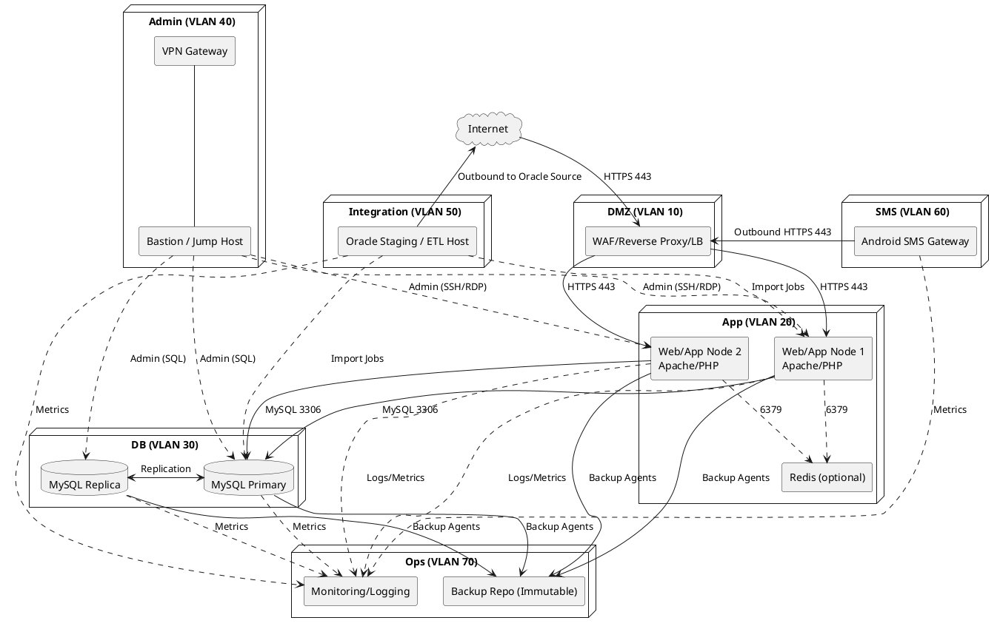

## Network Architecture Diagram (One‑Page Compact: Focused Features)

This compact diagram focuses on: Priority Generator, Analytics, SMS Messaging, Chat, and Feedback Board.

```mermaid
flowchart LR
  %% Logical flows (end-to-end communication)
  Users[Users (Browsers)\nWi‑Fi/Ethernet] -- HTTPS 443 --> Internet
  SMS[Android SMS Gateway\nWi‑Fi/4G] -- HTTPS 443 --> Internet
  Internet --> RP[Reverse Proxy / WAF]
  RP -- HTTPS 443 --> APP[Web/App (Apache+PHP)]
  APP -- MySQL 3306 (Ethernet) --> DB[(MySQL DB)]

  %% Feature modules (served by App)
  APP -. AJAX/API .-> PRI[Priority Generator]
  APP -. AJAX/API .-> ANA[Analytics]
  APP -. HTTP/API .-> CHAT[Chat Feature]
  APP -. AJAX/API .-> FB[Feedback Board]

  %% Physical topology (star) with connection types
  subgraph Star[Star Physical Topology]
    Core[Core Switch]
    Edge[Edge Switch / AP]
  end

  RP -- Ethernet 1G/10G --- Core
  APP -- Ethernet 1G/10G --- Core
  DB  -- Ethernet 1G/10G --- Core
  Edge -- Ethernet --> Core
  Users -- Wi‑Fi/Ethernet --> Edge

  %% Minimal labels for one-page fit
  %% Internet exposure: 443 only; App→DB: 3306 only
```

Notes (print-friendly):
- Internet exposure: HTTPS 443 to `Reverse Proxy/WAF` only; feature endpoints are routed through it.
- Data: `Web/App` communicates with `MySQL` on 3306; Analytics reads aggregated data from DB.
- SMS: Android gateway initiates outbound HTTPS to Proxy (no inbound to the device).

---

## Appendix A: Detailed Topology (Mermaid)
Copy/paste into any Markdown viewer supporting Mermaid to render.

```mermaid
flowchart LR
  internet([Internet])

  subgraph dmz["DMZ (VLAN 10, 10.10.10.0/24)"]
    waf[WAF / Reverse Proxy / LB\n(Nginx/HAProxy)]
  end

  subgraph app["App Tier (VLAN 20, 10.10.20.0/24)"]
    app1[Web/App Node 1\nApache/PHP]
    app2[Web/App Node 2\nApache/PHP]
    redis[(Redis - optional)]
  end

  subgraph db["DB Tier (VLAN 30, 10.10.30.0/24)"]
    db1[(MySQL Primary)]
    db2[(MySQL Replica)]
  end

  subgraph admin["Admin (VLAN 40, 10.10.40.0/24)"]
    vpn[VPN Gateway]
    bastion[Bastion / Jump Host]
  end

  subgraph integ["Integration (VLAN 50, 10.10.50.0/24)"]
    etl[Oracle Staging / ETL Host\n(Imports per ORACLE_IMPORT_GUIDE.md)]
  end

  subgraph sms["SMS (VLAN 60, 10.10.60.0/24)"]
    android[Android SMS Gateway\n(capcom6)]
  end

  subgraph ops["Ops (VLAN 70, 10.10.70.0/24)"]
    mon[Monitoring/Logging\n(Zabbix/Prometheus/ELK)]
    backup[Backup Repository\n(Immutable/Offsite)]
  end

  internet -- HTTPS 443 --> waf

  waf -- HTTPS 443 --> app1
  waf -- HTTPS 443 --> app2

  app1 -- MySQL 3306 --> db1
  app2 -- MySQL 3306 --> db1
  db1 <-- Replication --> db2

  app1 -. Sessions/Cache 6379 .-> redis
  app2 -. Sessions/Cache 6379 .-> redis

  vpn --- bastion
  bastion -. Admin Mgmt (RDP/SSH) .-> app1
  bastion -. Admin Mgmt (RDP/SSH) .-> app2
  bastion -. Admin Mgmt (SQL) .-> db1
  bastion -. Admin Mgmt (SQL) .-> db2

  etl -. Import Jobs .-> app1
  etl -. Import Jobs .-> db1
  etl -- Outbound to Oracle Source --> internet

  android -- Outbound HTTPS 443 --> waf

  app1 -. Logs/Metrics .-> mon
  app2 -. Logs/Metrics .-> mon
  db1  -. Metrics .-> mon
  db2  -. Metrics .-> mon
  etl  -. Metrics .-> mon
  android -. Metrics .-> mon

  app1 -- Backup Agents --> backup
  app2 -- Backup Agents --> backup
  db1  -- Backup Agents --> backup
  db2  -- Backup Agents --> backup

  classDef strict fill:#fff,stroke:#555,stroke-width:1px,color:#111;
  class waf,app1,app2,db1,db2,redis,vpn,bastion,etl,android,mon,backup strict;
```

## Appendix B: Detailed Topology (PlantUML alternative)



Notes:
- Only HTTPS (443) is exposed to the Internet via the WAF/Reverse Proxy.
- App tier can reach DB on 3306 only; default deny between VLANs.
- Admin access is VPN-only via bastion.
- ETL host handles Oracle imports per `ORACLE_IMPORT_GUIDE.md`.
- Android SMS gateway initiates outbound HTTPS to the WAF; no inbound allowed.


